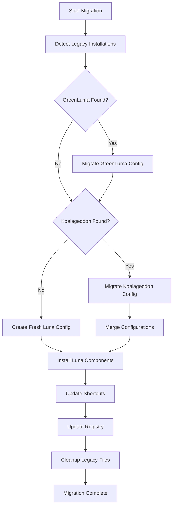

# Luna Rebranding and Unification Design Document

## Overview

This design document outlines the comprehensive rebranding and unification of GreenLuma and Koalageddon gaming tools into a single, cohesive software package called "Luna". The project involves systematic renaming of all components, restructuring of directories, updating of user interfaces, and maintaining full backward compatibility while presenting a unified brand experience.

Luna will serve as a comprehensive gaming tool that combines DLL injection capabilities (from GreenLuma) with DLC unlocking functionality (from Koalageddon) under a single, professional brand identity. The system will feature a modern Electron-based GUI that communicates with a Luna CLI backend, providing a polished user experience with advanced UI features while maintaining clear separation between presentation and business logic.

The entire repository will be systematically reorganized with a clean directory structure to improve maintainability and eliminate root directory clutter. The existing Python-based setup and configuration system will be enhanced to manage the unified Luna ecosystem.

## Architecture

### High-Level Architecture

```mermaid
graph TB
    subgraph "Luna Frontend"
        ElectronGUI[Electron GUI Application]
        WebUI[Modern Web UI Components]
        Themes[Themes & Animations]
    end
    
    subgraph "Luna Backend (CLI)"
        LunaCLI[Luna CLI Backend]
        LunaCore[Luna Core Engine]
        LunaAPI[Luna API Layer]
    end
    
    subgraph "Luna Components"
        LunaInjector[Luna Injector<br/>(formerly GreenLuma)]
        LunaUnlocker[Luna Unlocker<br/>(formerly Koalageddon)]
        LunaIntegration[Luna Integration Layer]
    end
    
    subgraph "Configuration & Setup"
        LunaSetup[Luna Setup Tool]
        LunaConfig[Luna Configuration Manager]
        Migration[Legacy Migration System]
    end
    
    subgraph "Platform Integration"
        Steam[Steam Platform]
        Epic[Epic Games]
        Origin[Origin/EA Desktop]
        Uplay[Ubisoft Connect]
    end
    
    ElectronGUI --> WebUI
    ElectronGUI --> Themes
    ElectronGUI --> LunaAPI
    
    LunaAPI --> LunaCLI
    LunaCLI --> LunaCore
    LunaCore --> LunaInjector
    LunaCore --> LunaUnlocker
    LunaCore --> LunaIntegration
    
    LunaSetup --> LunaConfig
    LunaSetup --> Migration
    LunaSetup --> LunaCore
    
    LunaIntegration --> Steam
    LunaIntegration --> Epic
    LunaIntegration --> Origin
    LunaIntegration --> Uplay
```

### Repository Structure Reorganization

The entire repository will be systematically reorganized to eliminate root directory clutter and improve maintainability:

```
luna/                              # Root project directory
├── README.md                      # Main project documentation
├── LICENSE                        # Project license
├── pyproject.toml                 # Python project configuration
├── requirements.txt               # Python dependencies
├── .gitignore                     # Git ignore rules
├── .github/                       # GitHub workflows and templates
│   └── workflows/                 # CI/CD workflows
├── src/                           # Source code directory
│   └── luna/                      # Main Luna package
│       ├── __init__.py            # Package initialization
│       ├── core/                  # Core Luna functionality
│       │   ├── __init__.py
│       │   ├── luna_core.py       # Main Luna engine
│       │   ├── injector.py        # Injection functionality
│       │   ├── unlocker.py        # DLC unlocking functionality
│       │   └── integration.py     # Platform integration
│       ├── cli/                   # CLI backend
│       │   ├── __init__.py
│       │   ├── luna_cli.py        # Main CLI interface
│       │   ├── api.py             # API layer for GUI communication
│       │   └── commands.py        # CLI command implementations
│       ├── setup/                 # Setup and configuration
│       │   ├── __init__.py
│       │   ├── setup_tool.py      # Main setup tool
│       │   ├── migration.py       # Legacy migration utilities
│       │   └── config_manager.py  # Configuration management
│       ├── managers/              # Various manager classes
│       │   ├── __init__.py
│       │   ├── file_operations.py
│       │   ├── security_config.py
│       │   ├── shortcut_manager.py
│       │   └── display_managers.py
│       └── models/                # Data models and schemas
│           ├── __init__.py
│           ├── config.py          # Configuration models
│           ├── results.py         # Result tracking models
│           └── exceptions.py      # Custom exceptions
├── gui/                           # Electron GUI application
│   ├── package.json               # Node.js dependencies
│   ├── main.js                    # Electron main process
│   ├── preload.js                 # Electron preload script
│   ├── src/                       # GUI source code
│   │   ├── index.html             # Main HTML file
│   │   ├── css/                   # Stylesheets
│   │   ├── js/                    # JavaScript modules
│   │   └── components/            # UI components
│   └── assets/                    # GUI assets
│       ├── icons/                 # Application icons
│       └── themes/                # UI themes
├── tests/                         # Test suite
│   ├── __init__.py
│   ├── conftest.py                # Pytest configuration
│   ├── unit/                      # Unit tests
│   │   ├── test_core/
│   │   ├── test_setup/
│   │   ├── test_managers/
│   │   └── test_models/
│   ├── integration/               # Integration tests
│   │   ├── test_migration/
│   │   ├── test_platform_integration/
│   │   └── test_gui_cli_integration/
│   └── fixtures/                  # Test fixtures and data
├── config/                        # Configuration files and templates
│   ├── luna_config.jsonc          # Default Luna configuration
│   ├── platforms.json             # Platform-specific settings
│   └── templates/                 # Configuration templates
├── assets/                        # Runtime assets and resources
│   ├── luna/                      # Luna-branded assets
│   │   ├── injector/              # Injector components
│   │   └── unlocker/              # Unlocker components
│   └── legacy/                    # Legacy assets for migration
├── docs/                          # Documentation
│   ├── setup/                     # Setup guides
│   ├── migration/                 # Migration documentation
│   ├── api/                       # API documentation
│   └── development/               # Development guides
└── scripts/                       # Build and utility scripts
    ├── build.py                   # Build automation
    ├── package.py                 # Packaging scripts
    └── dev_setup.py               # Development environment setup
```

### Luna Runtime Directory Structure

The installed Luna application will have the following structure:

```
Luna/                              # Installation directory
├── core/                          # Core Luna functionality
│   ├── injector/                  # Luna Injector (GreenLuma functionality)
│   │   ├── luna_injector.exe      # Renamed from DLLInjector.exe
│   │   ├── luna_injector.ini      # Renamed from DLLInjector.ini
│   │   ├── luna_core_x64.dll      # Renamed from GreenLuma_2020_x64.dll
│   │   ├── luna_core_x86.dll      # Renamed from GreenLuma_2020_x86.dll
│   │   └── luna_settings.exe      # Renamed from GreenLumaSettings_2023.exe
│   └── unlocker/                  # Luna Unlocker (Koalageddon functionality)
│       ├── luna_unlocker.dll      # Main unlocker library
│       ├── luna_integration.dll   # Integration layer
│       ├── luna_wizard.exe        # Integration wizard
│       └── luna_common.dll        # Common utilities
├── gui/                           # Electron GUI application
│   ├── luna-gui.exe               # Main GUI executable
│   └── resources/                 # GUI resources and assets
├── cli/                           # CLI backend
│   ├── luna.exe                   # Main CLI executable
│   └── api/                       # API server components
├── config/                        # Configuration files
│   ├── luna_config.jsonc          # Main Luna configuration
│   ├── platforms.json             # Platform-specific settings
│   └── migration/                 # Migration utilities
└── docs/                          # User documentation
    ├── README.md                  # Luna documentation
    ├── SETUP.md                   # Setup instructions
    └── MIGRATION.md               # Migration guide
```

## Components and Interfaces

### 1. Electron GUI Application

The Luna GUI will be built as a modern Electron application that provides an attractive, feature-rich interface while communicating with the Luna CLI backend.

**Key Features:**
- Modern web technologies (HTML5, CSS3, JavaScript/TypeScript)
- Advanced UI features including animations, themes, and responsive design
- Real-time communication with CLI backend through well-defined APIs
- Cross-platform compatibility and native OS integration
- Customizable themes and user preferences

**Architecture Components:**
```javascript
// Main Electron process
class LunaMainProcess {
    constructor()
    initializeWindow(): void
    setupAPIBridge(): void
    handleCLICommunication(): void
}

// Renderer process (UI)
class LunaRenderer {
    constructor()
    initializeUI(): void
    bindEventHandlers(): void
    communicateWithCLI(command: string, params: object): Promise<any>
}

// API Bridge for CLI communication
class LunaCLIBridge {
    sendCommand(command: string, params: object): Promise<any>
    subscribeToEvents(callback: Function): void
    getStatus(): Promise<LunaStatus>
}
```

**GUI-CLI Communication Protocol:**
- RESTful API endpoints for standard operations
- WebSocket connections for real-time updates
- JSON-based message format for data exchange
- Error handling and retry mechanisms
- Authentication and security for local communication

### 2. Luna CLI Backend

The CLI backend serves as the core engine that handles all Luna operations while providing a clean API interface for the GUI.

**Key Responsibilities:**
- Execute all Luna core functionality (injection, unlocking, configuration)
- Provide RESTful API endpoints for GUI communication
- Handle file operations, security configurations, and system integration
- Manage background processes and monitoring
- Provide command-line interface for advanced users

**API Design:**
```python
class LunaCLIAPI:
    def __init__(self, port: int = 8080)
    
    # Core operations
    async def start_injection(self, config: dict) -> dict
    async def start_unlocking(self, config: dict) -> dict
    async def get_status(self) -> dict
    async def stop_operations(self) -> dict
    
    # Configuration management
    async def get_config(self) -> dict
    async def update_config(self, config: dict) -> dict
    async def migrate_legacy_config(self) -> dict
    
    # System operations
    async def create_shortcuts(self) -> dict
    async def setup_security_exclusions(self) -> dict
    async def check_system_compatibility(self) -> dict
```

### 3. Luna Core Engine

The Luna Core Engine serves as the central orchestrator for all Luna functionality, providing a unified interface for both injection and unlocking capabilities.

**Key Responsibilities:**
- Coordinate between injector and unlocker components
- Manage platform detection and integration
- Handle configuration loading and validation
- Provide unified logging and error handling
- Manage process monitoring and injection timing

**Interface Design:**
```python
class LunaCore:
    def __init__(self, config_path: Path)
    def initialize(self) -> bool
    def start_monitoring(self) -> None
    def stop_monitoring(self) -> None
    def inject_process(self, process_id: int, platform: str) -> bool
    def unlock_dlc(self, app_id: str, platform: str) -> bool
    def get_status(self) -> LunaStatus
```

### 4. Luna Configuration System

The configuration system will be enhanced to handle the unified Luna ecosystem while maintaining backward compatibility with existing GreenLuma and Koalageddon configurations.

**Configuration Hierarchy:**
- **luna_config.jsonc**: Main configuration file with unified settings
- **platforms.json**: Platform-specific configurations (Steam, Epic, etc.)
- **migration.json**: Migration mappings for legacy configurations
- **user_preferences.json**: User-specific settings and customizations

**Configuration Schema:**
```json
{
  "luna": {
    "version": "1.0.0",
    "core": {
      "injector_enabled": true,
      "unlocker_enabled": true,
      "auto_start": false,
      "stealth_mode": true
    },
    "platforms": {
      "steam": { "enabled": true, "priority": 1 },
      "epic": { "enabled": true, "priority": 2 },
      "origin": { "enabled": true, "priority": 3 },
      "uplay": { "enabled": true, "priority": 4 }
    },
    "paths": {
      "core_directory": "%DOCUMENTS%/Luna",
      "config_directory": "%APPDATA%/Luna",
      "temp_directory": "%TEMP%/Luna"
    }
  }
}
```

### 5. Luna Setup Tool Enhancement

The existing Python setup tool will be enhanced to handle Luna branding and unified installation.

**Enhanced Features:**
- Automatic detection and migration of existing GreenLuma/Koalageddon installations
- Unified installation process for all Luna components
- Enhanced progress tracking with Luna branding
- Comprehensive error handling with Luna-specific messaging
- Desktop shortcut creation with Luna branding

**Key Classes to Update:**
```python
class LunaSetupTool:  # Renamed from GamingSetupTool
    def __init__(self, verbose: bool = False)
    async def run(self) -> None
    async def migrate_legacy_installations(self) -> None
    async def install_luna_components(self) -> None
    async def create_luna_shortcuts(self) -> None

class LunaConfig:  # Enhanced from SetupConfig
    luna_core_path: Path
    luna_config_path: Path
    legacy_greenluma_path: Optional[Path]
    legacy_koalageddon_path: Optional[Path]
```

### 6. Migration System

A comprehensive migration system will handle the transition from existing GreenLuma and Koalageddon installations to Luna.

**Migration Components:**
- **Legacy Detection**: Automatically detect existing installations
- **Configuration Migration**: Convert old configurations to Luna format
- **File Migration**: Move or copy existing files to Luna structure
- **Shortcut Updates**: Update desktop shortcuts to point to Luna
- **Registry Updates**: Update Windows registry entries for Luna

**Migration Process Flow:**


## Data Models

### Enhanced Configuration Models

```python
@dataclass
class LunaConfig:
    """Unified configuration for Luna system."""
    
    # Core paths
    luna_core_path: Path
    luna_config_path: Path
    luna_temp_path: Path
    
    # Component settings
    injector_enabled: bool = True
    unlocker_enabled: bool = True
    auto_start: bool = False
    stealth_mode: bool = True
    
    # Platform configurations
    platform_configs: Dict[str, PlatformConfig] = field(default_factory=dict)
    
    # Legacy migration settings
    migrate_greenluma: bool = True
    migrate_koalageddon: bool = True
    preserve_legacy: bool = False
    
    @classmethod
    def from_legacy_configs(cls, greenluma_config: Optional[Path], 
                          koalageddon_config: Optional[Path]) -> 'LunaConfig'

@dataclass
class PlatformConfig:
    """Configuration for specific gaming platforms."""
    
    name: str
    enabled: bool
    process_name: str
    priority: int
    unlock_dlc: bool = True
    unlock_shared_library: bool = True
    app_blacklist: List[str] = field(default_factory=list)
    process_blacklist: List[str] = field(default_factory=list)

@dataclass
class LunaResults:
    """Results of Luna operations with enhanced tracking."""
    
    # Migration results
    legacy_installations_found: List[str] = field(default_factory=list)
    configurations_migrated: List[Tuple[str, bool]] = field(default_factory=list)
    shortcuts_updated: List[Tuple[str, bool]] = field(default_factory=list)
    
    # Installation results
    components_installed: List[Tuple[str, bool]] = field(default_factory=list)
    luna_shortcuts_created: List[Tuple[str, bool]] = field(default_factory=list)
    
    # Inherited from SetupResults
    directories_created: List[Path] = field(default_factory=list)
    exclusions_added: List[Tuple[Path, bool]] = field(default_factory=list)
    errors: List[str] = field(default_factory=list)
    warnings: List[str] = field(default_factory=list)
```

### Shortcut Configuration Updates

```python
@dataclass
class LunaShortcutConfig:
    """Enhanced shortcut configuration for Luna branding."""
    
    name: str
    component: str  # 'injector', 'unlocker', 'manager', 'settings'
    target_path: Path
    working_directory: Path
    icon_path: Optional[Path] = None
    description: Optional[str] = None
    luna_branding: bool = True
    
    @property
    def display_name(self) -> str:
        """Get display name with Luna branding."""
        if self.luna_branding:
            return f"Luna {self.name}"
        return self.name
    
    @property
    def luna_description(self) -> str:
        """Get description with Luna branding."""
        base_desc = self.description or f"Luna {self.component.title()}"
        return f"{base_desc} - Unified Gaming Tool"
```

## Error Handling

### Luna-Specific Error Categories

```python
class LunaError(GamingSetupError):
    """Base exception for Luna-specific errors."""
    pass

class LunaMigrationError(LunaError):
    """Errors during legacy migration process."""
    pass

class LunaConfigurationError(LunaError):
    """Errors in Luna configuration management."""
    pass

class LunaComponentError(LunaError):
    """Errors in Luna component operations."""
    pass

class LunaCompatibilityError(LunaError):
    """Errors related to platform or software compatibility."""
    pass
```

### Enhanced Error Handling

The error handling system will be updated to provide Luna-specific error messages and solutions:

```python
class LunaErrorManager(ErrorManager):
    """Enhanced error manager with Luna-specific handling."""
    
    def get_luna_solution(self, error: LunaError) -> str:
        """Get Luna-specific solution for errors."""
        
    def display_luna_error(self, error: Exception, context: str) -> None:
        """Display errors with Luna branding."""
        
    def categorize_luna_error(self, error: Exception) -> ErrorCategory:
        """Categorize errors with Luna-specific logic."""
```

## Testing Strategy

### Unit Testing Updates

All existing unit tests will be updated to reflect Luna branding:

1. **Test File Renaming**: All test files will be updated to test Luna-branded components
2. **Mock Data Updates**: Test data will use Luna naming conventions
3. **Assertion Updates**: Test assertions will verify Luna-branded outputs
4. **Configuration Testing**: Tests will verify Luna configuration handling

### Integration Testing

New integration tests will be added to verify:

1. **Migration Testing**: Verify successful migration from legacy installations
2. **Component Integration**: Test interaction between Luna injector and unlocker
3. **Platform Integration**: Test Luna functionality across different gaming platforms
4. **Configuration Integration**: Test unified configuration management

### Regression Testing

Comprehensive regression testing will ensure:

1. **Functional Compatibility**: All existing functionality remains intact
2. **Performance Consistency**: Luna performs at least as well as individual tools
3. **Configuration Compatibility**: Legacy configurations are properly migrated
4. **Platform Compatibility**: Luna works across all supported platforms

### Test Categories

```python
class TestLunaCore:
    """Test Luna core functionality."""
    
class TestLunaMigration:
    """Test migration from legacy installations."""
    
class TestLunaConfiguration:
    """Test Luna configuration management."""
    
class TestLunaIntegration:
    """Test integration between Luna components."""
    
class TestLunaBranding:
    """Test Luna branding consistency."""
```

## Implementation Phases

### Phase 1: Core Rebranding
- Update all Python code with Luna naming conventions
- Rename configuration files and update schemas
- Update user interface elements and messages
- Modify logging and error messages

### Phase 2: Directory Structure Migration
- Implement new Luna directory structure
- Create migration utilities for existing installations
- Update path handling throughout the codebase
- Test directory structure changes

### Phase 3: Component Integration
- Integrate GreenLuma and Koalageddon functionality under Luna branding
- Update component interfaces and communication
- Implement unified configuration management
- Test component integration

### Phase 4: User Experience Enhancement
- Update desktop shortcuts and branding
- Enhance setup tool with Luna branding
- Implement migration wizard for existing users
- Update documentation and help text

### Phase 5: Testing and Validation
- Comprehensive testing of all Luna functionality
- Validation of migration processes
- Performance testing and optimization
- User acceptance testing

## Security Considerations

### Windows Defender Integration
- Update security exclusion paths to use Luna directories
- Ensure Luna executables are properly signed
- Update antivirus detection handling for Luna components

### Registry Management
- Update Windows registry entries to use Luna keys
- Implement registry cleanup for legacy entries
- Ensure proper permissions for Luna registry operations

### File System Security
- Implement secure file operations for Luna components
- Ensure proper permissions on Luna directories
- Handle file system security for migration operations

## Backward Compatibility

### Legacy Support
- Maintain ability to detect and migrate existing installations
- Provide fallback mechanisms for legacy configurations
- Support gradual migration without breaking existing setups

### Configuration Migration
- Automatic detection of GreenLuma and Koalageddon configurations
- Intelligent merging of configuration settings
- Preservation of user customizations during migration

### User Experience Continuity
- Maintain familiar functionality while improving branding
- Provide clear migration guidance and feedback
- Ensure no loss of functionality during transition

This design provides a comprehensive framework for transforming the existing GreenLuma and Koalageddon tools into a unified Luna gaming platform while maintaining all existing functionality and providing a smooth migration path for existing users.